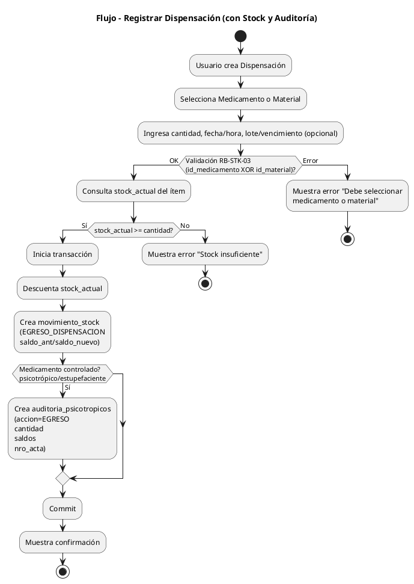
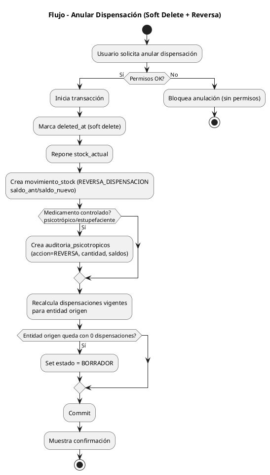

requerimiento_funcional_unificación_del_ciclo_vida_entidades_2026-03-03_08-27.txt
Documento

diagrama_tablas_farmacia_2026-03-03_09-29.txt
Documento
Te presento el diagrama de tablas del sistema farmacia y el requerimiento funcional de una de las partes mas cruciales del sistema el mecanismo de registro de las entidades medicas recetas recetas, 
suministros enfermería, tratamientos crónicos. Aquí están faltando cosas clave y es el manejo de estock ya que no se esta llevando acabo al realizar la carga de las dispensaciones deberían descontar el estock en medicamentos y materiales de enfermería. Además hay que analizar el efecto de este manejo de estock en el archivo de auditorias de estupefacientes y psicotrópicos ya que debe reflejar el movimiento de estock si se dice que se entregaron medicamentos de estas categorías debe estar reflejado allí sin embargo si se crea una receta y se la elimina y no se entregaron medicamentos también debe estar reflejado en el sentido que si los medicamentos están en el stock entonces no se suministraron. Tampoco se modelo el proceso de compras o de ingreso de medicamentos, los medicamentos no son comprados desde la unidad sino que se reciben desde la farmacia Central. Es un flujo complejo y requiero tu ayuda, pueden faltar tablas para reflejar la operatoria.


Pensó durante 12s
A continuación te dejo una propuesta de ampliación del requerimiento funcional para cubrir lo que falta: gestión de stock (medicamentos y materiales) + impacto en auditoría de estupefacientes/psicotrópicos + flujo de ingreso desde Farmacia Central, partiendo de tu RF actual de ciclo de vida 
requerimiento_funcional_unifica…

 y del diagrama de tablas 
diagrama_tablas_farmacia_2026-0…

.

1) Contexto y objetivo del cambio
Hoy el sistema registra dispensaciones vinculadas a entidades médicas (recetas / tratamientos crónicos / suministros) 
diagrama_tablas_farmacia_2026-0…

, pero no descuenta stock en medicamentos.stock_actual ni materiales_enfermeria.stock_actual 
diagrama_tablas_farmacia_2026-0…

. Además, la auditoría de psicotrópicos/estupefacientes existe 
diagrama_tablas_farmacia_2026-0…

, pero debe representar consistentemente el movimiento real de stock, incluso ante anulaciones/eliminaciones y “recetas que no terminan en entrega”.

Objetivo: implementar un modelo transaccional de movimientos de stock (kardex) que se dispare desde dispensaciones y desde recepciones (Farmacia Central), con reglas claras para auditoría especial (psicotrópicos/estupefacientes).

2) Alcance
Incluye
Descuento / restitución de stock por alta/baja/anulación de dispensaciones.

Registro de movimientos de stock para medicamentos y materiales.

Asegurar consistencia con auditoria_psicotropicos (saldos y acciones) 
diagrama_tablas_farmacia_2026-0…

.

Modelado de ingresos desde Farmacia Central (no compras locales).

Manejo por lote y vencimiento (ya existen campos en dispensaciones: nro_lote, fecha_vencimiento) 
diagrama_tablas_farmacia_2026-0…

.

Excluye
Proceso de compra (orden de compra, proveedor, factura) — explícitamente no aplica según tu operadoría.

Optimización avanzada (forecasting, reposición automática), salvo alertas por mínimos.

3) Actores y entidades involucradas
Actores

Médico/Profesional: crea receta/tratamiento/suministro (ciclo de vida).

Enfermería/Farmacia: registra dispensaciones.

Farmacia Central: emite remito/transferencia.

Auditor/Autoridad: consulta libros y auditorías.

Entidades actuales relevantes

dispensaciones (origen, medicamento/material, cantidad, lote, vencimiento, soft delete) 
diagrama_tablas_farmacia_2026-0…


medicamentos / materiales_enfermeria (stock_actual, mínimos) 
diagrama_tablas_farmacia_2026-0…


auditoria_psicotropicos (acción, cantidad, saldo_anterior/nuevo, acta) 
diagrama_tablas_farmacia_2026-0…


Entidades médicas (recetas, tratamientos_cronicos, suministros_enfermeria) 
diagrama_tablas_farmacia_2026-0…


4) Requerimientos funcionales nuevos (Stock + Auditoría)
4.1 Movimientos de stock (kardex) – requisito base
RF-STK-01: El sistema debe registrar un MovimientoStock por cada operación que altere stock (ingreso desde central, dispensación, anulación, ajuste, vencimiento/baja).
RF-STK-02: El sistema debe actualizar el saldo (stock_actual) del ítem afectado en forma atómica (misma transacción que el movimiento).
RF-STK-03: El sistema debe soportar stock por tipo de ítem: MEDICAMENTO o MATERIAL.
RF-STK-04: El sistema debe soportar trazabilidad por lote y vencimiento (cuando aplique), reutilizando nro_lote / fecha_vencimiento que ya existen en dispensaciones 
diagrama_tablas_farmacia_2026-0…

.

4.2 Dispensaciones impactan stock
RF-DISP-STK-01: Al crear una dispensación con id_medicamento o id_material, el sistema debe descontar stock del ítem y registrar MovimientoStock tipo EGRESO_DISPENSACION.
RF-DISP-STK-02: Al eliminar/anular una dispensación (soft delete deleted_at) 
diagrama_tablas_farmacia_2026-0…

, el sistema debe restituir stock mediante MovimientoStock tipo REVERSA_DISPENSACION.
RF-DISP-STK-03: Si una dispensación es editada (cantidad / ítem / lote), el sistema debe generar los movimientos compensatorios necesarios (reversa del previo + egreso del nuevo), preservando auditoría.

4.3 Reglas de integridad de stock
RB-STK-01: No se debe permitir una dispensación que deje stock negativo, salvo que el rol tenga permiso explícito de “dispensar bajo stock” (queda auditado).
RB-STK-02: El descuento debe considerar stock del lote si se opera por lotes; si no se especifica lote, se descuenta del stock general y se registra movimiento sin lote.
RB-STK-03: Al registrar una dispensación, si fecha_vencimiento está vencida, el sistema debe bloquear o requerir confirmación con rol superior (según política).

4.4 Auditoría de psicotrópicos/estupefacientes alineada al stock
Hoy existe auditoria_psicotropicos con accion, cantidad, saldo_anterior, saldo_nuevo, nro_acta 
diagrama_tablas_farmacia_2026-0…

.

RF-AUD-PSI-01: Cuando una dispensación involucre un medicamento con es_psicotropico o es_estupefaciente 
diagrama_tablas_farmacia_2026-0…

, el sistema debe generar un registro en auditoria_psicotropicos asociado al evento de stock (no solo al “borrado”).
RF-AUD-PSI-02: La auditoría debe registrar saldo_anterior y saldo_nuevo coherentes con el stock resultante del movimiento.
RF-AUD-PSI-03: Si una dispensación de estas categorías se revierte (anulación/eliminación), debe generarse una auditoría con accion = REVERSA (o equivalente), reflejando que el stock volvió (y por lo tanto “no se suministró”).
RF-AUD-PSI-04: Crear una receta y luego eliminarla sin dispensaciones no debe generar movimientos ni auditoría de psicotrópicos (porque no hubo egreso). Esto se alinea con tu modelo de entidades en BORRADOR/ACTIVO 
requerimiento_funcional_unifica…

.

Nota: tu RF actual menciona auditoría al eliminar dispensación psicotrópica 
requerimiento_funcional_unifica…

. Aquí lo extendemos para cubrir toda la vida del movimiento (egreso y reversa), no solo eliminación.

5) Flujo de ingreso desde Farmacia Central (sin compras)
Modelo funcional
RF-ING-01: El sistema debe permitir registrar una Recepción desde Farmacia Central (cabecera) con datos de remito/acta, fecha/hora, usuario y unidad destino.
RF-ING-02: La recepción debe tener ítems (medicamento/material, cantidad, lote, vencimiento).
RF-ING-03: Al confirmar la recepción, el sistema debe aumentar stock y generar MovimientoStock tipo INGRESO_CENTRAL por cada ítem.
RB-ING-01: Una recepción en BORRADOR no afecta stock; solo al CONFIRMAR.
RB-ING-02: La anulación de una recepción confirmada debe generar reversa de stock y auditoría si aplica (psicotrópicos/estupefacientes).

6) Tablas que probablemente faltan (propuesta mínima)
Tu diseño actual guarda stock_actual en medicamentos y materiales_enfermeria 
diagrama_tablas_farmacia_2026-0…

, pero no tiene un kardex general. Para auditar y cuadrar, sugiero incorporar:

movimientos_stock (kardex unificado)

id_movimiento (PK)

tipo_item (MEDICAMENTO|MATERIAL)

id_medicamento (nullable)

id_material (nullable)

tipo_movimiento (INGRESO_CENTRAL | EGRESO_DISPENSACION | REVERSA_DISPENSACION | AJUSTE | BAJA_VENCIMIENTO)

cantidad

saldo_anterior

saldo_nuevo

nro_lote (nullable)

fecha_vencimiento (nullable)

origen_tipo (DISPENSACION|RECEPCION_CENTRAL|AJUSTE)

origen_id

id_usuario

fecha/hora

observaciones

recepciones_central (cabecera)

id_recepcion, nro_remito, fecha/hora, unidad_id, estado (BORRADOR|CONFIRMADA|ANULADA), id_usuario, observaciones

recepciones_central_items

id_item, id_recepcion, tipo_item, id_medicamento/id_material, cantidad, lote, vencimiento

Con esto, stock_actual queda como cache (saldo rápido), y movimientos_stock como fuente audit-able.

7) Reglas clave de consistencia con tus “entidades médicas” (receta/tratamiento/suministro)
El estado BORRADOR/ACTIVO que ya definiste 
requerimiento_funcional_unifica…

 sigue siendo válido, pero:

Stock no debería moverse por cambiar estado, solo por dispensaciones (y recepciones/ajustes).

Si una entidad pasa a ACTIVO con dispensaciones, ya hubo egresos; si luego se revierten dispensaciones, el stock vuelve y la entidad debería:

o bien impedir remover la última dispensación si la entidad está ACTIVA (tu RB/RF actual) 
requerimiento_funcional_unifica…

,

o permitirlo pero obligar transición a BORRADOR/CANCELADA con trazabilidad (recomendación: agregar estado CANCELADA para casos administrativos).

8) PlantUML propuesto (tablas nuevas + relaciones)
@startuml
!theme plain

entity movimientos_stock {
  *id_movimiento : bigint
  tipo_item : enum  'MEDICAMENTO|MATERIAL
  id_medicamento : int
  id_material : int
  tipo_movimiento : enum  'INGRESO_CENTRAL|EGRESO_DISPENSACION|REVERSA_DISPENSACION|AJUSTE|BAJA_VENCIMIENTO
  cantidad : decimal
  saldo_anterior : int
  saldo_nuevo : int
  nro_lote : varchar
  fecha_vencimiento : date
  origen_tipo : enum  'DISPENSACION|RECEPCION_CENTRAL|AJUSTE
  origen_id : bigint
  id_usuario : int
  fecha : date
  hora : time
  observaciones : text
  created_at : timestamp
}

entity recepciones_central {
  *id_recepcion : bigint
  nro_remito : varchar
  estado : enum  'BORRADOR|CONFIRMADA|ANULADA
  unidad_id : int
  fecha : date
  hora : time
  id_usuario : int
  observaciones : text
  created_at : timestamp
  updated_at : timestamp
}

entity recepciones_central_items {
  *id_item : bigint
  id_recepcion : bigint
  tipo_item : enum
  id_medicamento : int
  id_material : int
  cantidad : decimal
  nro_lote : varchar
  fecha_vencimiento : date
}

' Relaciones
recepciones_central ||--o{ recepciones_central_items : "contiene"
dispensaciones }o--|| movimientos_stock : "genera (origen_tipo=DISPENSACION)"
recepciones_central }o--|| movimientos_stock : "genera (origen_tipo=RECEPCION_CENTRAL)"

medicamentos }o--|| movimientos_stock : "id_medicamento"
materiales_enfermeria }o--|| movimientos_stock : "id_material"

@enduml
9) Criterios de aceptación (rápidos)
CA-01: Dada una dispensación de 5 unidades de un medicamento con stock_actual=10, cuando se guarda, entonces stock_actual=5 y existe un MovimientoStock con saldo_anterior=10, saldo_nuevo=5.

CA-02: Dada una dispensación psicotrópica confirmada, cuando se guarda, entonces existe registro en auditoria_psicotropicos con el mismo saldo_anterior/nuevo que el movimiento. 
diagrama_tablas_farmacia_2026-0…


CA-03: Dada una dispensación psicotrópica, cuando se anula (soft delete), entonces stock vuelve y auditoría registra acción REVERSA.

CA-04: Dada una receta sin dispensaciones en BORRADOR, cuando se elimina, entonces no hay movimientos de stock ni auditoría (porque no hubo egreso). 
requerimiento_funcional_unifica…


CA-05: Dada una recepción central CONFIRMADA, entonces incrementa stock y genera movimientos tipo INGRESO_CENTRAL por ítem.

10) Próximo paso recomendado (sin preguntarte nada “bloqueante”)
Con lo que ya pasaste, el mayor riesgo no es “tabla faltante”, sino definir qué significa eliminar/anular en términos de stock y auditoría.

Mi recomendación práctica:

No borrar físico dispensaciones (ya tienen deleted_at) 
diagrama_tablas_farmacia_2026-0…

 → usar “anulación” (soft delete) + reversa de stock.

Implementar movimientos_stock como fuente de verdad.

Hacer que auditoria_psicotropicos sea un subconjunto obligatorio cuando aplica (psicotrópicos/estupefacientes), tomando saldos del mismo cálculo.

Si querés, en el próximo mensaje puedo devolverte esto mismo como Requerimiento Funcional completo estilo “BA + QA + UX” (RF/RB + casos de uso + Gherkin + diagramas de flujo/DFD), integrándolo con tu documento de estados BORRADOR/ACTIVO.


Fuentes

Si por favor continuemos en esa linea


Pensó durante 12s
Perfecto. Tomo tu RF actual de estados BORRADOR/ACTIVO 
requerimiento_funcional_unifica…

 + el diagrama de tablas (dispensaciones, medicamentos/materiales con stock, auditoría psicotrópicos) 
diagrama_tablas_farmacia_2026-0…

 y lo extiendo para cubrir el flujo crítico que falta: stock + auditoría + ingresos desde Farmacia Central, manteniendo el estilo BA+QA+UX, con Flujo + DFD + PlantUML = SI.

Requerimiento Funcional Ampliado
Gestión de Stock + Auditoría de Psicotrópicos/Estupefacientes + Recepción desde Farmacia Central
CONFIGURACIÓN
PROFUNDIDAD: ANALÍTICO

SALIDA: Markdown

DIAGRAMAS: AMBOS (FLUJO + DFD)

PLANTUML: SI

1) Contexto y objetivo del cambio
El sistema registra dispensaciones (medicamentos y materiales) 
diagrama_tablas_farmacia_2026-0…

, y mantiene campos de stock en medicamentos.stock_actual y materiales_enfermeria.stock_actual 
diagrama_tablas_farmacia_2026-0…

, pero hoy no existe un mecanismo formal y trazable de movimientos de stock al crear/editar/anular dispensaciones.

Además, existe auditoria_psicotropicos con saldos y acción 
diagrama_tablas_farmacia_2026-0…

, pero debe reflejar coherentemente el stock real:

si se entrega psicotrópico/estupefaciente → debe registrarse egreso + auditoría

si se revierte/anula → debe registrarse reversa + auditoría

si se crea una receta y se elimina sin entrega → no debe simular egreso

Objetivo: implementar un kardex (movimientos_stock) y un flujo de recepción desde Farmacia Central (sin compras), integrando todo con el modelo de estados BORRADOR/ACTIVO ya definido 
requerimiento_funcional_unifica…

.

2) Alcance
Incluye
Descuento/reversa de stock por alta/edición/anulación de dispensaciones.

Registro de movimientos de stock (kardex) con saldo_anterior/saldo_nuevo.

Auditoría obligatoria para psicotrópicos/estupefacientes alineada al movimiento real 
diagrama_tablas_farmacia_2026-0…

.

Recepción desde Farmacia Central (ingreso de stock, por remito/acta).

Trazabilidad por lote/vencimiento cuando esté informado (ya existe en dispensaciones) 
diagrama_tablas_farmacia_2026-0…

.

Excluye
Proceso de compra local (OC/proveedores/facturas).

Forecast de reposición automática (solo alertas mínimas, si se decide).

3) Actores y entidades involucradas
Actores

Médico/Profesional: crea/edita Receta/Tratamiento/Suministro (estados).

Farmacia/Enfermería: registra dispensaciones.

Operador Depósito/Recepción: registra ingresos desde Farmacia Central.

Auditor: consulta libros/movimientos/auditoría.

Entidades existentes (base)

dispensaciones (con soft delete deleted_at) 
diagrama_tablas_farmacia_2026-0…


medicamentos / materiales_enfermeria (stock_actual) 
diagrama_tablas_farmacia_2026-0…


auditoria_psicotropicos (saldos) 
diagrama_tablas_farmacia_2026-0…


recetas, tratamientos_cronicos, suministros_enfermeria 
diagrama_tablas_farmacia_2026-0…


4) Requerimientos funcionales (RF)
4.1 RF existentes (se conservan)
Se mantienen los RF-01..RF-06 de estados BORRADOR/ACTIVO y activación por existencia de dispensaciones 
requerimiento_funcional_unifica…

.

Importante: el sistema ya define que ACTIVO implica “tiene al menos una dispensación” 
requerimiento_funcional_unifica…

.

4.2 Gestión de stock por dispensación (nuevo)
RF-STK-01 (MovimientoStock): El sistema debe registrar un movimiento de stock por cada evento que afecte stock: INGRESO_CENTRAL, EGRESO_DISPENSACION, REVERSA_DISPENSACION, AJUSTE, BAJA_VENCIMIENTO.

RF-STK-02 (Transaccionalidad): La creación/anulación/edición de dispensación y el movimiento de stock asociado deben ejecutarse en una única transacción (si falla uno, falla todo).

RF-DISP-STK-01 (Alta): Al crear una dispensación con id_medicamento o id_material 
diagrama_tablas_farmacia_2026-0…

, el sistema debe:

validar stock disponible

descontar stock_actual del ítem

crear movimiento EGRESO_DISPENSACION con saldo_anterior/saldo_nuevo

si aplica control especial, crear auditoría (ver 4.3)

RF-DISP-STK-02 (Edición): Al editar una dispensación (cantidad / ítem / lote / vencimiento), el sistema debe:

revertir el egreso anterior (movimiento REVERSA_DISPENSACION)

aplicar el nuevo egreso (movimiento EGRESO_DISPENSACION)

recalcular auditoría si aplica

RF-DISP-STK-03 (Anulación / Soft Delete): Al anular/eliminar una dispensación (uso de deleted_at) 
diagrama_tablas_farmacia_2026-0…

, el sistema debe:

restituir stock

crear movimiento REVERSA_DISPENSACION

generar auditoría reversa si aplica

4.3 Auditoría psicotrópicos/estupefacientes (nuevo, alineado al stock)
Existe tabla auditoria_psicotropicos con cantidad, saldo_anterior, saldo_nuevo y accion 
diagrama_tablas_farmacia_2026-0…

; y la dispensación también tiene flags es_psicotropico 
diagrama_tablas_farmacia_2026-0…

.

RF-AUD-01 (Egreso): Si el medicamento dispensado está marcado como psicotrópico o estupefaciente 
diagrama_tablas_farmacia_2026-0…

, el sistema debe crear un registro en auditoria_psicotropicos con:

accion = EGRESO

cantidad igual a la dispensación

saldo_anterior/saldo_nuevo iguales a los del movimiento de stock

RF-AUD-02 (Reversa): Si una dispensación controlada se anula, el sistema debe crear auditoría con:

accion = REVERSA

cantidad igual a la revertida

saldos coherentes con stock final

RF-AUD-03 (No simular entrega): La creación/eliminación de una receta/tratamiento/suministro sin dispensaciones no debe generar movimientos ni auditoría (no hubo egreso). Esto preserva el modelo BORRADOR editable/eliminable 
requerimiento_funcional_unifica…

.

RF-AUD-04 (Nro Acta): Si se informa nro_acta en dispensación 
diagrama_tablas_farmacia_2026-0…

, debe copiarse a auditoría para trazabilidad.

4.4 Recepción desde Farmacia Central (nuevo, sin compras)
RF-ING-01 (Recepción cabecera): El sistema debe permitir crear una Recepción desde Farmacia Central con nro_remito / fecha/hora / unidad / usuario / observaciones.

RF-ING-02 (Items): La Recepción debe permitir cargar ítems (medicamento o material) con cantidad, lote, vencimiento.

RF-ING-03 (Confirmación): Al confirmar la Recepción:

aumentar stock_actual por ítem

crear movimiento INGRESO_CENTRAL por ítem (con saldos)

RF-ING-04 (Anulación): La anulación de una Recepción confirmada debe generar movimientos inversos (y auditoría si aplica por control especial).

5) Reglas de negocio y validaciones (RB)
RB-STK-01 (No negativo): No permitir egreso que deje stock negativo. Excepción: rol “Supervisor” puede forzar y queda auditado en movimiento.

RB-STK-02 (Lote/Vencimiento): Si se informa lote/vencimiento en dispensación 
diagrama_tablas_farmacia_2026-0…

, el movimiento debe guardarlos.

RB-STK-03 (Consistencia origen): Toda dispensación debe tener exactamente uno de: id_medicamento o id_material (no ambos, no ninguno) 
diagrama_tablas_farmacia_2026-0…

.

RB-EST-01 (Estado ACTIVO): Se mantiene la regla: no se puede eliminar la última dispensación de una entidad ACTIVA (señalado como excepción E1) 
requerimiento_funcional_unifica…

.
RB-EST-02 (Decisión pendiente): Si se habilita “volver a BORRADOR”, debe definirse su impacto sobre stock (recomendación: no tocar stock por estado; solo por dispensaciones).

RB-AUD-01 (Auditoría obligatoria): Si el medicamento es controlado, no se puede confirmar la operación de egreso/reversa sin generar auditoría coherente.

6) Datos y modelo (tablas nuevas propuestas)
6.1 Tabla nueva: movimientos_stock (kardex)
Campos mínimos:

id_movimiento (PK)

tipo_item (MEDICAMENTO|MATERIAL)

id_medicamento / id_material

tipo_movimiento (INGRESO_CENTRAL|EGRESO_DISPENSACION|REVERSA_DISPENSACION|AJUSTE|BAJA_VENCIMIENTO)

cantidad

saldo_anterior, saldo_nuevo

nro_lote, fecha_vencimiento

origen_tipo (DISPENSACION|RECEPCION_CENTRAL|AJUSTE), origen_id

id_usuario, fecha, hora, observaciones, created_at

6.2 Tablas nuevas: recepciones_central + recepciones_central_items
cabecera (remito/estado/unidad/usuario/fechas)

items (ítem/cantidad/lote/vencimiento)

7) Casos de uso (CU)
CU-01 Registrar Dispensación (con stock + auditoría)
Usuario Farmacia crea dispensación (elige origen: receta/tratamiento/suministro) 
diagrama_tablas_farmacia_2026-0…


Sistema valida stock disponible

Sistema descuenta stock_actual

Sistema crea movimiento EGRESO_DISPENSACION

Si controlado: crea auditoría EGRESO con saldos 
diagrama_tablas_farmacia_2026-0…


Retorna a detalle de la entidad origen

CU-02 Anular Dispensación (soft delete)
Usuario autorizado elimina (marca deleted_at) 
diagrama_tablas_farmacia_2026-0…


Sistema crea movimiento REVERSA_DISPENSACION y repone stock

Si controlado: crea auditoría REVERSA

Regresa con confirmación

CU-03 Recepción desde Farmacia Central
Operador crea Recepción (BORRADOR)

Carga ítems (medicamentos/materiales)

Confirma recepción

Sistema genera movimientos INGRESO_CENTRAL y actualiza stock

8) Criterios de aceptación (Gherkin)
Caso A: Dispensación descuenta stock

Given Medicamento X con stock_actual=10 
diagrama_tablas_farmacia_2026-0…


When Registro una dispensación por cantidad=3 
diagrama_tablas_farmacia_2026-0…


Then stock_actual queda en 7

And existe un movimiento EGRESO con saldo_anterior=10 y saldo_nuevo=7

Caso B: Anulación repone stock

Given Existe una dispensación activa de cantidad=3

When La elimino (soft delete) 
diagrama_tablas_farmacia_2026-0…


Then stock_actual vuelve al valor anterior

And existe movimiento REVERSA correspondiente

Caso C: Auditoría EGRESO psicotrópico

Given Medicamento marcado como psicotrópico 
diagrama_tablas_farmacia_2026-0…


When Registro dispensación

Then se crea auditoría con accion=EGRESO y saldos coherentes 
diagrama_tablas_farmacia_2026-0…


Caso D: Auditoría REVERSA psicotrópico

Given Dispensación psicotrópica registrada

When Se anula

Then se crea auditoría con accion=REVERSA con saldos coherentes

Caso E: Receta eliminada sin entrega

Given Receta en BORRADOR sin dispensaciones 
requerimiento_funcional_unifica…


When Se elimina la receta

Then no se generan movimientos_stock ni auditoría

9) Impacto en UI/UX
En detalle de entidad (receta/tratamiento/suministro): mostrar stock disponible al seleccionar medicamento/material (opcional, recomendado).

En pantalla de dispensación:

advertencia de stock bajo (stock_actual <= stock_minimo) 
diagrama_tablas_farmacia_2026-0…


si controlado, exigir nro_acta (si la política lo define) 
diagrama_tablas_farmacia_2026-0…


Nuevo módulo/pantalla: Recepción Farmacia Central con estados BORRADOR/CONFIRMADA/ANULADA.

Auditoría: vista “Libro de psicotrópicos/estupefacientes” filtrable por fecha/medicamento/acta.

10) Riesgos / pendientes de decisión (críticos)
Transición ACTIVO → BORRADOR: tu doc lo deja abierto 
requerimiento_funcional_unifica…

. Recomendación: si se implementa, que sea administrativa y no afecte stock (stock solo por dispensaciones).

Soft delete vs hard delete: dispensaciones ya tienen deleted_at 
diagrama_tablas_farmacia_2026-0…

. Recomendación: evitar hard delete en producción.

Stock por lote real: hoy hay lote/vencimiento en dispensación 
diagrama_tablas_farmacia_2026-0…

, pero no existe tabla de lotes. Decidir si:

(mínimo viable) solo se “registra” en movimiento/auditoría

(robusto) crear lotes_stock por medicamento

DIAGRAMAS (PlantUML)
A) Diagrama de Actividad: Registrar Dispensación con Stock + Auditoría
@startuml
title Flujo - Registrar Dispensación (con Stock y Auditoría)
start
:Usuario crea Dispensación;
:Selecciona Medicamento o Material;
:Ingresa cantidad, fecha/hora, lote/vencimiento (opcional);

if (Validación RB-STK-03\n(id_medicamento XOR id_material)?) then (OK)
  :Consulta stock_actual del ítem;
  if (stock_actual >= cantidad?) then (Sí)
    :Inicia transacción;
    :Descuenta stock_actual;
    :Crea movimiento_stock\n(EGRESO_DISPENSACION\nsaldo_ant/saldo_nuevo);
    if (Medicamento controlado?\npsicotrópico/estupefaciente) then (Sí)
      :Crea auditoria_psicotropicos\n(accion=EGRESO\ncantidad\nsaldos\nnro_acta);
    endif
    :Commit;
    :Muestra confirmación;
    stop
  else (No)
    :Muestra error "Stock insuficiente";
    stop
  endif
else (Error)
  :Muestra error "Debe seleccionar\nmedicamento o material";
  stop
endif
@enduml
B) Diagrama de Actividad: Anular Dispensación (Soft Delete) con Reversa
@startuml
title Flujo - Anular Dispensación (Soft Delete + Reversa)
start
:Usuario solicita eliminar/anular dispensación;

if (Entidad origen está ACTIVA\ny es la última dispensación?) then (Sí)
  :Bloquea eliminación\n(regla E1);
  stop
else (No)
  :Inicia transacción;
  :Marca deleted_at;
  :Repone stock_actual;
  :Crea movimiento_stock\n(REVERSA_DISPENSACION\nsaldo_ant/saldo_nuevo);
  if (Medicamento controlado?) then (Sí)
    :Crea auditoria_psicotropicos\n(accion=REVERSA\ncantidad\nsaldos);
  endif
  :Commit;
  :Muestra confirmación;
  stop
endif
@enduml
C) DFD Nivel 1: Gestión de Dispensación + Stock + Auditoría + Recepción
@startuml
title DFD Nivel 1 - Dispensación/Stock/Auditoría/Recepción Central
actor "Farmacia/Enfermería" as FE
actor "Depósito/Recepción" as DR
actor "Médico" as Med

entity "Sistema Farmacia" as SF

database "BD: Entidades Médicas\n(recetas/tratamientos/suministros)" as BD_EM
database "BD: Dispensaciones" as BD_D
database "BD: Stock\n(medicamentos/materiales)" as BD_S
database "BD: Movimientos Stock\n(kardex)" as BD_MS
database "BD: Auditoría\nPsicotrópicos" as BD_A
database "BD: Recepciones Central" as BD_R

Med -> SF : 1. Crea/Edita Entidad (BORRADOR/ACTIVO)
SF -> BD_EM : 2. Guarda/Actualiza estado

FE -> SF : 3. Registra Dispensación
SF -> BD_S : 4. Consulta/Actualiza stock_actual
SF -> BD_MS : 5. Registra movimiento EGRESO/REVERSA
SF -> BD_D : 6. Guarda/Anula dispensación
SF -> BD_A : 7. Si controlado: EGRESO/REVERSA auditoría

DR -> SF : 8. Registra Recepción Central
SF -> BD_R : 9. Guarda recepción (BORRADOR/CONFIRMADA)
SF -> BD_S : 10. Al confirmar: incrementa stock_actual
SF -> BD_MS : 11. Registra movimiento INGRESO_CENTRAL
SF -> BD_A : 12. Si controlado: auditoría por ingreso (si aplica política)

SF --> FE : 13. Confirmaciones/Errores
SF --> DR : 14. Confirmaciones/Errores
SF --> Med : 15. Estado/Detalle actualizado
@enduml
D) PlantUML ER (tablas nuevas propuestas)
@startuml
!theme plain
entity movimientos_stock {
  *id_movimiento : bigint
  tipo_item : enum
  id_medicamento : int
  id_material : int
  tipo_movimiento : enum
  cantidad : decimal
  saldo_anterior : int
  saldo_nuevo : int
  nro_lote : varchar
  fecha_vencimiento : date
  origen_tipo : enum
  origen_id : bigint
  id_usuario : int
  fecha : date
  hora : time
  observaciones : text
  created_at : timestamp
}

entity recepciones_central {
  *id_recepcion : bigint
  nro_remito : varchar
  estado : enum
  unidad_id : int
  fecha : date
  hora : time
  id_usuario : int
  observaciones : text
  created_at : timestamp
  updated_at : timestamp
}

entity recepciones_central_items {
  *id_item : bigint
  id_recepcion : bigint
  tipo_item : enum
  id_medicamento : int
  id_material : int
  cantidad : decimal
  nro_lote : varchar
  fecha_vencimiento : date
}

recepciones_central ||--o{ recepciones_central_items : contiene
recepciones_central }o--|| movimientos_stock : genera (origen=RECEPCION)
dispensaciones }o--|| movimientos_stock : genera (origen=DISPENSACION)
medicamentos }o--|| movimientos_stock : id_medicamento
materiales_enfermeria }o--|| movimientos_stock : id_material
@enduml
Para seguir (paso siguiente inmediato)
En tu RF original quedó abierta la “desactivación” (ACTIVO→BORRADOR) 
requerimiento_funcional_unifica…

. Para que el stock/auditoría no explote, mi recomendación de diseño es:

Estado NO mueve stock.

Dispensación SÍ mueve stock.

Si se necesita “cancelar receta”, se agrega estado CANCELADA (administrativo), sin tocar stock; el stock solo vuelve si se revierten dispensaciones.

Si querés, en el próximo mensaje te redacto la sección “Estados finales (CANCELADA/COMPLETADA)” y su matriz de permisos (Médico vs Farmacia vs Auditor), manteniendo compatibilidad con E1 y con auditoría.


Fuentes

explicame este condicional en el diagrama B [if (Entidad origen está ACTIVA\ny es la última dispensación?) then (Sí)
  :Bloquea eliminación\n(regla E1);
  stop
else (No)
  :Inicia transacción;
  :Marca deleted_at;
  :Repone stock_actual;
  :Crea movimiento_stock\n(REVERSA_DISPENSACION\nsaldo_ant/saldo_nuevo);
  if (Medicamento controlado?) then (Sí)
    :Crea auditoria_psicotropicos\n(accion=REVERSA\ncantidad\nsaldos);
  endif
  :Commit;
  :Muestra confirmación;
  stop
endif ] por que se bloquea cuando esta activa por ejemplo una receta y es la ultima dispensación no debería ejecutarse la restitución al estock?  no me queda clara la lógica y la justificación.

Tenés razón en cuestionarlo: la restitución de stock sí debería ocurrir si se está anulando una dispensación que ya existía (porque esa dispensación ya descontó stock cuando se creó). El condicional del diagrama B mezcla dos preocupaciones distintas:

Regla de negocio de estados (tu E1: “no eliminar la última dispensación si la entidad está ACTIVA”) 
requerimiento_funcional_unifica…


Integridad de stock/auditoría (si anulo una dispensación → tengo que revertir stock y, si aplica, auditoría)

Qué estaba intentando prevenir ese “bloqueo”
Ese if (Entidad origen está ACTIVA y es la última dispensación) estaba pensado para evitar un estado inconsistente:

Si tu definición es: ACTIVO = “tiene al menos una dispensación” 
requerimiento_funcional_unifica…


Entonces, si borrás/anulás la última dispensación pero dejás la entidad en ACTIVO, queda una contradicción: ACTIVO sin dispensaciones.

Hasta ahí, la preocupación es válida.

Pero… ¿por qué bloquear en vez de revertir stock?
Ahí está el problema: bloquear la eliminación no es la única opción, y en la práctica suele ser la peor si el usuario necesita corregir una entrega mal registrada.

Si la dispensación existía, lo correcto es:

Anular la dispensación

Revertir stock

Registrar auditoría reversa si aplica

Y luego resolver el tema del estado de la entidad origen (receta/tratamiento/suministro)

O sea: el stock no debería quedar “retenido” solo para sostener el estado ACTIVO.

La lógica correcta depende de qué política querés para el estado ACTIVO
Hay 2 políticas razonables (elegí una; yo recomiendo la 1).

Política 1 (recomendada): permitir anulación y cambiar el estado automáticamente
Regla: ACTIVO depende de dispensaciones reales.

Si anulás la última dispensación de una receta ACTIVA:

Se revierte stock (siempre)

Se genera movimiento REVERSA

Si controlado → auditoría REVERSA

Y la entidad origen:

pasa a BORRADOR o CANCELADA (según tu modelo), o

queda ACTIVA pero con flag “sin dispensaciones” (no recomendable)

Con esto, no bloqueás la corrección operativa y no rompés consistencia.

Política 2: bloquear (solo si querés prohibir “desentregas” en ACTIVO)
Esto aplica si el negocio dice:

“Si está ACTIVA, lo entregado es definitivo; no se puede revertir por sistema; debe hacerse un ajuste administrativo con otro circuito.”

En ese caso sí bloqueás, pero entonces tenés que proveer un caso alternativo:

“Ajuste de stock” (con acta)

o “Nota de crédito / devolución” formal

o “Anulación total de entidad” con permisos especiales

Si no existe ese circuito, bloquear te deja sin salida.

Entonces, ¿cómo debería quedar el condicional?
En vez de bloquear antes de revertir, separalo en dos decisiones:

¿Se puede anular la dispensación? (permisos, estado cerrada/liquidada, etc.)

¿Qué pasa con el estado de la entidad origen luego de anular?

Versión corregida del flujo B (conceptual)
Siempre que anules una dispensación válida:

revertís stock (y auditoría si corresponde)

Luego:

si era la última y la entidad estaba ACTIVA → actualizás el estado (p.ej. a BORRADOR/CANCELADA) o marcás inconsistencia y la resolvés

La regla E1 
requerimiento_funcional_unifica…

 se puede reinterpretar así:

“No se permite que una entidad quede ACTIVA sin dispensaciones; si se anula la última dispensación, el sistema debe ajustar el estado.”

Eso preserva el espíritu sin bloquear.

Ejemplo concreto (tu caso)
Receta ACTIVA con 1 dispensación de psicotrópico:

Se creó dispensación → stock bajó, auditoría EGRESO.

Se detecta error y se anula dispensación:

stock debe volver

auditoría REVERSA

la receta no puede seguir ACTIVA si tu definición es “ACTIVO = tiene dispensaciones”

✅ Solución: cambiar receta a BORRADOR o CANCELADA (o “ANULADA”) automáticamente.

Te propongo ajustar el diagrama B (PlantUML)
Te dejo una corrección directa del condicional (sin bloquear stock):

if (Usuario tiene permiso para anular?) then (Sí)
  :Inicia transacción;
  :Marca deleted_at;
  :Repone stock_actual;
  :Crea movimiento_stock (REVERSA_DISPENSACION);
  if (Medicamento controlado?) then (Sí)
    :Crea auditoria_psicotropicos (accion=REVERSA);
  endif

  if (Entidad origen estaba ACTIVA\ny ahora quedó sin dispensaciones?) then (Sí)
    :Cambiar estado entidad origen a BORRADOR o CANCELADA;
  endif

  :Commit;
  :Muestra confirmación;
  stop
else (No)
  :Bloquea anulación (sin permisos);
  stop
endif
Si me decís cuál de estas 3 opciones preferís para el estado cuando se anula la última dispensación (sin pedirte más datos del negocio), yo te cierro la “matriz de estados” completa:

ACTIVO → BORRADOR automático

ACTIVO → CANCELADA automática

Se mantiene ACTIVO pero se crea “Ajuste administrativo” obligatorio (más pesado, pero a veces es lo legal)


Fuentes

la politica 1 es la recomendada 

Perfecto: con Política 1 dejamos una regla clara y “a prueba de auditorías”:

El stock siempre se mueve por DISPENSACIONES (y recepciones/ajustes), nunca por el estado.

El estado ACTIVO es derivado: ACTIVO ⇔ tiene al menos una dispensación no anulada 
requerimiento_funcional_unifica…


Si se anula la última dispensación, el sistema revierte stock y además ajusta automáticamente el estado para no violar esa definición.

Abajo te lo dejo formalizado, con las correcciones al flujo B y los RF/RB específicos.

1) Regla base (formal)
RB-EST-BASE: Una entidad médica (receta / tratamiento crónico / suministro enfermería) está:

ACTIVA si tiene ≥ 1 dispensación vigente (no soft-deleted).

BORRADOR si tiene 0 dispensaciones vigentes. 
requerimiento_funcional_unifica…


Esto es consistente con tu documento: el sistema activa cuando hay dispensaciones 
requerimiento_funcional_unifica…

.

2) Qué pasa al anular una dispensación (lógica completa)
Caso A: anulo una dispensación y no era la última
Resultado:

Reversa de stock ✅

Auditoría REVERSA si aplica ✅

Entidad origen sigue ACTIVA ✅

Caso B: anulo una dispensación y era la última (tu duda)
Resultado (Política 1):

Reversa de stock ✅ (obligatoria)

Auditoría REVERSA si aplica ✅

Entidad origen pasa automáticamente a BORRADOR ✅

Esto resuelve tu pregunta: no se bloquea; se revierte stock y se corrige estado.

3) Corrección del “Condicional B” (PlantUML)
Reemplazamos el bloqueo por “ajuste de estado”:

@startuml
title Flujo - Anular Dispensación (Política 1)

start
:Usuario solicita anular dispensación;

if (Permisos OK?) then (Sí)
  :Inicia transacción;
  :Marca deleted_at (soft delete);
  :Repone stock_actual;
  :Crea movimiento_stock (REVERSA_DISPENSACION\nsaldo_ant/saldo_nuevo);

  if (Medicamento controlado?\npsicotrópico/estupefaciente) then (Sí)
    :Crea auditoria_psicotropicos\n(accion=REVERSA, cantidad, saldos);
  endif

  :Recalcula dispensaciones vigentes\npara entidad origen;

  if (Entidad origen queda con 0 dispensaciones?) then (Sí)
    :Set estado = BORRADOR;
  endif

  :Commit;
  :Muestra confirmación;
  stop
else (No)
  :Bloquea anulación (sin permisos);
  stop
endif
@enduml
4) RF/RB nuevos para “Política 1” (para que quede escrito y testeable)
RF-EST-01 (Estado derivado): El sistema debe mantener el estado ACTIVO/BORRADOR de una entidad origen en función de sus dispensaciones vigentes. 
requerimiento_funcional_unifica…


RF-EST-02 (Reversión automática): Si una entidad origen está ACTIVA y, tras anular una dispensación, queda con 0 dispensaciones vigentes, el sistema debe cambiar su estado a BORRADOR automáticamente.

RB-EST-01 (Prohibición de inconsistencia): No debe existir una entidad en estado ACTIVO sin dispensaciones vigentes.

RF-STK-REV-01 (Reversa obligatoria): La anulación (soft delete) de una dispensación debe generar reversa de stock y movimiento de stock, independientemente del estado de la entidad origen.

RF-AUD-REV-01 (Reversa controlados): Si el ítem es psicotrópico/estupefaciente, la reversa debe registrar auditoría REVERSA con saldos coherentes. 
diagrama_tablas_farmacia_2026-0…


5) Criterios de aceptación (muy directos)
CA-EST-01 (Última dispensación):
Given Receta ACTIVA con 1 dispensación vigente
When anulo la dispensación
Then el stock se repone
And se genera movimiento REVERSA
And la receta pasa a BORRADOR

CA-EST-02 (No última):
Given Receta ACTIVA con 2 dispensaciones vigentes
When anulo 1
Then el stock se repone
And la receta continúa ACTIVA

6) Nota importante para implementación (para evitar bugs)
Como dispensaciones tiene deleted_at 
diagrama_tablas_farmacia_2026-0…

, “cantidad de dispensaciones” siempre debe contarse como:

vigentes = where deleted_at is null

y el cambio de estado debe ocurrir en la misma transacción de la reversa.

Si te parece bien, el próximo paso es que te arme la “Matriz de transiciones” completa (BORRADOR/ACTIVO + eventos: crear entidad, agregar dispensación, anular dispensación, editar dispensación), y que la anexemos como sección formal del RF para dev + QA.


Fuentes

si haz una matriz de transiciones 

Perfecto. Acá tenés una matriz de transiciones consistente con la Política 1 (estado derivado de dispensaciones) y con tu modelo BORRADOR/ACTIVO 
requerimiento_funcional_unifica…

, contemplando stock y auditoría.

Matriz de transiciones de estado
Entidades origen: recetas, tratamientos_cronicos, suministros_enfermeria 
diagrama_tablas_farmacia_2026-0…


Estados: BORRADOR, ACTIVO 
requerimiento_funcional_unifica…


Principio: el estado depende de la cantidad de dispensaciones vigentes (deleted_at IS NULL) 
diagrama_tablas_farmacia_2026-0…

.

A) Reglas de derivación (las que mandan)
Regla	Condición	Estado resultante
RD-01	#Dispensaciones vigentes = 0	BORRADOR
RD-02	#Dispensaciones vigentes ≥ 1	ACTIVO
Esto implementa literalmente “ACTIVO ⇔ tiene dispensaciones” 
requerimiento_funcional_unifica…

.

B) Matriz de eventos y transición
Notación:

ΔStock: impacto en medicamentos.stock_actual / materiales_enfermeria.stock_actual 
diagrama_tablas_farmacia_2026-0…


Kardex: alta en movimientos_stock (nuevo)

Aud: alta en auditoria_psicotropicos cuando aplique 
diagrama_tablas_farmacia_2026-0…


Evento	Precondición	Estado antes	Acción principal	Estado después	ΔStock	Kardex	Aud
E-01 Crear entidad origen	—	—	Crear receta/tratamiento/suministro	BORRADOR	No	No	No
E-02 Editar entidad origen	Entidad sin dispensaciones vigentes	BORRADOR	Editar campos permitidos	BORRADOR	No	No	No
E-03 Eliminar entidad origen	Entidad sin dispensaciones vigentes	BORRADOR	Eliminar (según tu política: soft/hard)	—	No	No	No
E-04 Registrar 1ra dispensación	Stock suficiente	BORRADOR	Crear dispensación (deleted_at NULL) 
diagrama_tablas_farmacia_2026-0…

ACTIVO	-	EGRESO_DISPENSACION	EGRESO (si controlado)
E-05 Registrar dispensación adicional	Stock suficiente	ACTIVO	Crear nueva dispensación	ACTIVO	-	EGRESO_DISPENSACION	EGRESO (si controlado)
E-06 Editar dispensación (cantidad/ítem)	Dispensación vigente	ACTIVO o BORRADOR*	Reversa del egreso anterior + nuevo egreso	(recalcular)**	±	REVERSA + EGRESO	REVERSA+EGRESO (si controlado)
E-07 Anular dispensación que NO es la última	Dispensación vigente; quedan ≥1	ACTIVO	Soft delete (deleted_at) 
diagrama_tablas_farmacia_2026-0…

ACTIVO	+	REVERSA_DISPENSACION	REVERSA (si controlado)
E-08 Anular la ÚLTIMA dispensación	Dispensación vigente; quedan 0	ACTIVO	Soft delete (deleted_at)	BORRADOR	+	REVERSA_DISPENSACION	REVERSA (si controlado)
E-09 Confirmar recepción central (ingreso)	Recepción en BORRADOR con items	—	Confirmar ingreso desde Central	—	+	INGRESO_CENTRAL	(opcional según política)
E-10 Anular recepción confirmada	Recepción CONFIRMADA	—	Reversa de ingreso	—	-	REVERSA_INGRESO	(opcional según política)
* Nota sobre BORRADOR con dispensaciones: con RD-01/RD-02 eso no debería ocurrir. Si aparece, es inconsistencia de datos y debe corregirse (por eso marco “ACTIVO o BORRADOR*”).
** “recalcular” = si tras la edición la dispensación sigue vigente, normalmente mantiene ACTIVO; si la edición implica “anular de facto” (poco común), aplicar RD-01/RD-02.

C) Detalle de “Editar dispensación” (E-06) para que QA lo pueda testear
Editar dispensación es peligrosa porque cambia saldos. La forma segura es:

REVERSA del registro original (reponer stock y auditoría reversa si aplica)

EGRESO del nuevo valor (descontar stock y auditoría egreso si aplica)

Eso garantiza que los saldos de auditoria_psicotropicos (saldo_anterior/saldo_nuevo) 
diagrama_tablas_farmacia_2026-0…

 queden coherentes con el stock real.

D) Reglas de permisos sugeridas (mini-matriz)
Acción	Rol mínimo recomendado
Crear/editar entidad origen (BORRADOR)	Médico/Profesional
Registrar dispensación	Farmacia/Enfermería
Anular dispensación	Farmacia responsable / Supervisor
Confirmar recepción central	Depósito/Recepción
Anular recepción confirmada	Supervisor + Auditoría (si controlados)
E) PlantUML (estado + eventos) para anexar al RF
@startuml
title Estados Entidad Origen (Política 1: estado derivado)

[*] --> BORRADOR : E-01 Crear entidad

BORRADOR --> BORRADOR : E-02 Editar entidad (sin dispensaciones)
BORRADOR --> [*] : E-03 Eliminar entidad (sin dispensaciones)

BORRADOR --> ACTIVO : E-04 Registrar 1ra dispensación / EGRESO stock

ACTIVO --> ACTIVO : E-05 Registrar dispensación adicional / EGRESO stock
ACTIVO --> ACTIVO : E-07 Anular dispensación (quedan >=1) / REVERSA stock
ACTIVO --> BORRADOR : E-08 Anular última dispensación (quedan 0) / REVERSA stock

ACTIVO --> ACTIVO : E-06 Editar dispensación / (REVERSA + EGRESO)

@enduml
Si querés, el siguiente paso natural es que te arme la matriz de transiciones para DISPENSACIONES (VIGENTE/ANULADA) y cómo se mapea con deleted_at 
diagrama_tablas_farmacia_2026-0…

 + sus movimientos de stock + auditoría, que es la otra mitad para que dev/QA implementen sin dudas.


Fuentes

Perfecto ahora en el estado del proyecto tengo que encontrar un orden de solicitud de features para copilot en visual code como me sugieres avanzar? quizás deberíamos comenzar por agregar la tabla de movimientos de stock y luego?

Sí: para que Copilot te ayude bien (y para bajar riesgo), lo mejor es pedir features en un orden por capas, empezando por el modelo de dominio + reglas transaccionales y recién después UI/reportes.

Acá tenés un roadmap de requests (cada ítem es un “prompt/feature request” que podés pegar en VS Code + Copilot). Está ordenado para que cada paso deje el sistema funcionando y testeable.

Orden recomendado de implementación (MVP → robusto)
0) Preparación
Inventario de endpoints/servicios actuales: dónde se crea/anula/edita dispensaciones y dónde se toca stock_actual.

Confirmar que dispensaciones usa deleted_at y que las consultas “vigentes” filtran deleted_at IS NULL 
diagrama_tablas_farmacia_2026-0…

.

1) Capa de datos: Kardex (movimientos_stock) + constraints
Feature 1.1 — Migración DB: movimientos_stock

Crear tabla movimientos_stock con: tipo_item, id_medicamento/id_material, tipo_movimiento, cantidad, saldo_anterior/saldo_nuevo, lote, vencimiento, origen_tipo/origen_id, usuario, timestamps.

Feature 1.2 — Índices y reglas

Índices por (tipo_item, id_medicamento/id_material), por (origen_tipo, origen_id), por fecha.

Constraint: exactamente uno de id_medicamento o id_material (XOR).

Esto es lo primero porque te habilita auditar y depurar cualquier bug de stock sin “adivinar”.

2) Capa de dominio: Servicio transaccional de stock (único punto de verdad)
Feature 2.1 — StockService.applyMovement()

API interna que reciba: tipo_movimiento, item, cantidad, lote/vencimiento, origen, usuario

Calcule saldo_anterior/saldo_nuevo

Actualice stock_actual en medicamentos / materiales_enfermeria 
diagrama_tablas_farmacia_2026-0…


Inserte movimientos_stock

Todo en 1 transacción

Feature 2.2 — Validación no negativo

Si EGRESO y stock < cantidad → error (salvo rol supervisor).

Este paso es el “corazón”: después todo (dispensaciones/recepciones/auditoría) solo llama a este servicio.

3) Integración: Dispensaciones mueven stock (alta/anulación/edición)
Feature 3.1 — Alta de dispensación ⇒ EGRESO_DISPENSACION

Hook en “create dispensación” para llamar StockService.

Feature 3.2 — Anulación (soft delete) ⇒ REVERSA_DISPENSACION

Hook en “delete/annul dispensación” que:

set deleted_at 
diagrama_tablas_farmacia_2026-0…


llama StockService con reversa

(todavía sin cambiar estado entidad origen; eso es 3.4)

Feature 3.3 — Edición de dispensación ⇒ (REVERSA + EGRESO)

Editar cantidad/ítem/lote: reversa del registro original + egreso nuevo.

Feature 3.4 — Política 1 de estados (derivado)

Después de alta/anulación/edición:

recalcular dispensaciones vigentes de la entidad origen

si >=1 ⇒ ACTIVO; si 0 ⇒ BORRADOR 
requerimiento_funcional_unifica…


Con esto, ya tenés stock coherente y estados coherentes.

4) Auditoría psicotrópicos/estupefacientes alineada al stock
Feature 4.1 — Auditoría EGRESO

Si el medicamento es psicotrópico/estupefaciente 
diagrama_tablas_farmacia_2026-0…

:

crear auditoria_psicotropicos con accion=EGRESO y saldos idénticos a movimiento 
diagrama_tablas_farmacia_2026-0…


Feature 4.2 — Auditoría REVERSA

Idem para reversa.

Importante: que la auditoría se base en los saldos calculados por StockService (no recalcular por separado).

5) Recepción desde Farmacia Central (ingresos)
Feature 5.1 — Tablas recepciones_central + items
Feature 5.2 — Confirmar recepción ⇒ INGRESO_CENTRAL
Feature 5.3 — Anular recepción ⇒ reversa de ingreso

6) UI/Reportes
Pantalla de kardex por ítem

Libro de psicotrópicos por rango de fechas/acta

Alertas de stock mínimo

“Prompts” listos para Copilot (ejemplos cortos)
Te dejo 3 que podés pegar tal cual, en orden:

Prompt A (migración)
“Crear migración para tabla movimientos_stock con columnas: tipo_item enum(MEDICAMENTO,MATERIAL), id_medicamento nullable FK, id_material nullable FK, tipo_movimiento enum(INGRESO_CENTRAL,EGRESO_DISPENSACION,REVERSA_DISPENSACION,AJUSTE,BAJA_VENCIMIENTO), cantidad decimal, saldo_anterior int, saldo_nuevo int, nro_lote varchar nullable, fecha_vencimiento date nullable, origen_tipo enum(DISPENSACION,RECEPCION_CENTRAL,AJUSTE), origen_id bigint, id_usuario int, created_at timestamp. Agregar constraint XOR id_medicamento/id_material e índices por origen_tipo+origen_id y por item.”

Prompt B (StockService)
“Implementar StockService.applyMovement(dto) transaccional: leer stock_actual del ítem, validar no-negativo en egresos, calcular saldo_anterior/saldo_nuevo, actualizar stock_actual, insertar registro en movimientos_stock con saldos y metadata (origen). Devolver el movimiento creado.”

Prompt C (anulación dispensación con Política 1)
“Al anular dispensación (soft delete), ejecutar en una transacción: set deleted_at, llamar StockService con REVERSA_DISPENSACION, si medicamento controlado generar auditoría REVERSA con los mismos saldos del movimiento; luego recalcular dispensaciones vigentes de la entidad origen y si queda 0 set estado=BORRADOR, si >=1 estado=ACTIVO.”

¿Entonces sí: primero movimientos_stock?
Sí. Primero movimientos_stock + StockService.
Sin eso, cada feature nueva (auditoría, recepción central, ediciones) te multiplica el riesgo de inconsistencias y te deja sin trazabilidad para debug.

Si me pegás en el chat:

stack (Laravel? Odoo? .NET?),

cómo se implementa hoy la creación/anulación de dispensaciones (controller/service),
te armo los prompts en el dialecto exacto del framework (migraciones, models, transactions, tests) sin que tengas que traducir nada.


Fuentes

#####################################################################

👤 Tú: Instrucciones:

Identifica y jerarquiza:

Título principal (#)

Subtítulos (##, ###, #### según corresponda)

Secciones y subsecciones implícitas

Detecta y convierte correctamente:

Listas numeradas

Listas con viñetas

Enumeraciones incrustadas en párrafos

Tablas si los datos presentan estructura tabular

Aplica formato semántico cuando corresponda:

Negrita para conceptos clave

Cursiva para términos técnicos o énfasis contextual

Bloques de cita (>) si el texto contiene citas

Bloques de código si hay contenido técnico

Mejora la legibilidad:

Divide párrafos excesivamente largos.

Separa ideas cuando haya más de un concepto por oración extensa.

Corrige errores mínimos de puntuación si afectan la claridad.

No alteres el contenido conceptual.

No resumir.

No interpretar.

No agregar información nueva.

Si detectas estructura ambigua, infiere la organización más lógica según coherencia temática.

Entrega únicamente el resultado final en Markdown correctamente estructurado.

 
Criterios de reconstrucción:

Prioriza jerarquía conceptual sobre orden visual original.

Detecta patrones repetitivos que indiquen secciones.

Convierte secuencias del tipo “1.” “2.” “3.” en listas estructuradas.

Si identificas relaciones comparativas, usa tablas.

Si identificas procesos, usa listas numeradas.

Si identificas definiciones, crea subtítulos tipo “Definición”.

Si identificas ventajas/desventajas, sepáralas en listas diferenciadas.

Mantén fidelidad total al contenido original.

Devuelve solo Markdown limpio, sin explicación adicional.

🤖 Gemini: 


# Requerimiento Funcional Ampliado: Gestión de Stock + Auditoría de Psicotrópicos/Estupefacientes + Recepción desde Farmacia Central

## 1) Contexto y objetivo del cambio
El sistema registra dispensaciones (medicamentos y materiales), y mantiene campos de stock en `medicamentos.stock_actual` y `materiales_enfermeria.stock_actual`, pero hoy no existe un mecanismo formal y trazable de movimientos de stock al crear/editar/anular dispensaciones.

Además, existe `auditoria_psicotropicos` con saldos y acción, pero debe reflejar coherentemente el stock real:
*   Si se entrega psicotrópico/estupefaciente → debe registrarse egreso + auditoría.
*   Si se revierte/anula → debe registrarse reversa + auditoría.
*   Si se crea una receta y se elimina sin entrega → no debe simular egreso.

**Objetivo:** Implementar un kardex (`movimientos_stock`) y un flujo de recepción desde Farmacia Central (sin compras), integrando todo con el modelo de estados BORRADOR/ACTIVO ya definido.

## 2) Alcance
### Incluye
*   Descuento/reversa de stock por alta/edición/anulación de dispensaciones.
*   Registro de movimientos de stock (kardex) con `saldo_anterior`/`saldo_nuevo`.
*   Auditoría obligatoria para psicotrópicos/estupefacientes alineada al movimiento real.
*   Recepción desde Farmacia Central (ingreso de stock, por remito/acta).
*   Trazabilidad por lote/vencimiento cuando esté informado (ya existe en dispensaciones).

### Excluye
*   Proceso de compra local (OC/proveedores/facturas).
*   Forecast de reposición automática (solo alertas mínimas, si se decide).

## 3) Actores y entidades involucradas
### Actores
*   **Médico/Profesional:** Crea/edita Receta/Tratamiento/Suministro (estados).
*   **Farmacia/Enfermería:** Registra dispensaciones.
*   **Operador Depósito/Recepción:** Registra ingresos desde Farmacia Central.
*   **Auditor:** Consulta libros/movimientos/auditoría.

### Entidades existentes (base)
*   `dispensaciones` (con soft delete `deleted_at`)
*   `medicamentos` / `materiales_enfermeria` (`stock_actual`)
*   `auditoria_psicotropicos` (saldos)
*   `recetas`, `tratamientos_cronicos`, `suministros_enfermeria`

## 4) Requerimientos funcionales (RF)
### 4.1 RF existentes (se conservan)
Se mantienen los RF-01..RF-06 de estados BORRADOR/ACTIVO y activación por existencia de dispensaciones.

**Importante:** El sistema ya define que ACTIVO implica “tiene al menos una dispensación”.

### 4.2 Gestión de stock por dispensación (nuevo)
*   **RF-STK-01 (MovimientoStock):** El sistema debe registrar un movimiento de stock por cada evento que afecte stock: `INGRESO_CENTRAL`, `EGRESO_DISPENSACION`, `REVERSA_DISPENSACION`, `AJUSTE`, `BAJA_VENCIMIENTO`.
*   **RF-STK-02 (Transaccionalidad):** La creación/anulación/edición de dispensación y el movimiento de stock asociado deben ejecutarse en una única transacción (si falla uno, falla todo).
*   **RF-DISP-STK-01 (Alta):** Al crear una dispensación con `id_medicamento` o `id_material`, el sistema debe:
    1.  Validar stock disponible.
    2.  Descontar `stock_actual` del ítem.
    3.  Crear movimiento `EGRESO_DISPENSACION` con `saldo_anterior`/`saldo_nuevo`.
    4.  Si aplica control especial, crear auditoría (ver 4.3).
*   **RF-DISP-STK-02 (Edición):** Al editar una dispensación (cantidad / ítem / lote / vencimiento), el sistema debe:
    1.  Revertir el egreso anterior (movimiento `REVERSA_DISPENSACION`).
    2.  Aplicar el nuevo egreso (movimiento `EGRESO_DISPENSACION`).
    3.  Recalcular auditoría si aplica.
*   **RF-DISP-STK-03 (Anulación / Soft Delete):** Al anular/eliminar una dispensación (uso de `deleted_at`), el sistema debe:
    1.  Restituir stock.
    2.  Crear movimiento `REVERSA_DISPENSACION`.
    3.  Generar auditoría reversa si aplica.

### 4.3 Auditoría psicotrópicos/estupefacientes (nuevo, alineado al stock)
Existe tabla `auditoria_psicotropicos` con `cantidad`, `saldo_anterior`, `saldo_nuevo` y `accion`; y la dispensación también tiene flags `es_psicotropico`.

*   **RF-AUD-01 (Egreso):** Si el medicamento dispensado está marcado como psicotrópico o estupefaciente, el sistema debe crear un registro en `auditoria_psicotropicos` con:
    *   `accion` = `EGRESO`
    *   `cantidad` igual a la dispensación
    *   `saldo_anterior`/`saldo_nuevo` iguales a los del movimiento de stock
*   **RF-AUD-02 (Reversa):** Si una dispensación controlada se anula, el sistema debe crear auditoría con:
    *   `accion` = `REVERSA`
    *   `cantidad` igual a la revertida
    *   Saldos coherentes con stock final
*   **RF-AUD-03 (No simular entrega):** La creación/eliminación de una receta/tratamiento/suministro sin dispensaciones no debe generar movimientos ni auditoría (no hubo egreso). Esto preserva el modelo BORRADOR editable/eliminable.
*   **RF-AUD-04 (Nro Acta):** Si se informa `nro_acta` en dispensación, debe copiarse a auditoría para trazabilidad.

### 4.4 Recepción desde Farmacia Central (nuevo, sin compras)
*   **RF-ING-01 (Recepción cabecera):** El sistema debe permitir crear una Recepción desde Farmacia Central con `nro_remito` / fecha/hora / unidad / usuario / observaciones.
*   **RF-ING-02 (Items):** La Recepción debe permitir cargar ítems (medicamento o material) con cantidad, lote, vencimiento.
*   **RF-ING-03 (Confirmación):** Al confirmar la Recepción:
    1.  Aumentar `stock_actual` por ítem.
    2.  Crear movimiento `INGRESO_CENTRAL` por ítem (con saldos).
*   **RF-ING-04 (Anulación):** La anulación de una Recepción confirmada debe generar movimientos inversos (y auditoría si aplica por control especial).

## 5) Reglas de negocio y validaciones (RB)
*   **RB-STK-01 (No negativo):** No permitir egreso que deje stock negativo. Excepción: rol “Supervisor” puede forzar y queda auditado en movimiento.
*   **RB-STK-02 (Lote/Vencimiento):** Si se informa lote/vencimiento en dispensación, el movimiento debe guardarlos.
*   **RB-STK-03 (Consistencia origen):** Toda dispensación debe tener exactamente uno de: `id_medicamento` o `id_material` (no ambos, no ninguno).
*   **RB-EST-01 (Estado ACTIVO):** Se mantiene la regla: no se puede eliminar la última dispensación de una entidad ACTIVA (señalado como excepción E1).
*   **RB-EST-02 (Decisión pendiente):** Si se habilita “volver a BORRADOR”, debe definirse su impacto sobre stock (recomendación: no tocar stock por estado; solo por dispensaciones).
*   **RB-AUD-01 (Auditoría obligatoria):** Si el medicamento es controlado, no se puede confirmar la operación de egreso/reversa sin generar auditoría coherente.

## 6) Datos y modelo (tablas nuevas propuestas)
### 6.1 Tabla nueva: `movimientos_stock` (kardex)
Campos mínimos:
*   `id_movimiento` (PK)
*   `tipo_item` (`MEDICAMENTO`|`MATERIAL`)
*   `id_medicamento` / `id_material`
*   `tipo_movimiento` (`INGRESO_CENTRAL`|`EGRESO_DISPENSACION`|`REVERSA_DISPENSACION`|`AJUSTE`|`BAJA_VENCIMIENTO`)
*   `cantidad`
*   `saldo_anterior`, `saldo_nuevo`
*   `nro_lote`, `fecha_vencimiento`
*   `origen_tipo` (`DISPENSACION`|`RECEPCION_CENTRAL`|`AJUSTE`), `origen_id`
*   `id_usuario`, `fecha`, `hora`, `observaciones`, `created_at`

### 6.2 Tablas nuevas: `recepciones_central` + `recepciones_central_items`
*   Cabecera (remito/estado/unidad/usuario/fechas)
*   Items (ítem/cantidad/lote/vencimiento)

## 7) Casos de uso (CU)
### CU-01 Registrar Dispensación (con stock + auditoría)
1.  Usuario Farmacia crea dispensación (elige origen: receta/tratamiento/suministro).
2.  Sistema valida stock disponible.
3.  Sistema descuenta `stock_actual`.
4.  Sistema crea movimiento `EGRESO_DISPENSACION`.
5.  Si controlado: crea auditoría `EGRESO` con saldos.
6.  Retorna a detalle de la entidad origen.

### CU-02 Anular Dispensación (soft delete)
1.  Usuario autorizado elimina (marca `deleted_at`).
2.  Sistema crea movimiento `REVERSA_DISPENSACION` y repone stock.
3.  Si controlado: crea auditoría `REVERSA`.
4.  Regresa con confirmación.

### CU-03 Recepción desde Farmacia Central
1.  Operador crea Recepción (BORRADOR).
2.  Carga ítems (medicamentos/materiales).
3.  Confirma recepción.
4.  Sistema genera movimientos `INGRESO_CENTRAL` y actualiza stock.

## 8) Criterios de aceptación (Gherkin)
### Caso A: Dispensación descuenta stock
*   **Given** Medicamento X con `stock_actual`=10
*   **When** Registro una dispensación por `cantidad`=3
*   **Then** `stock_actual` queda en 7
*   **And** existe un movimiento `EGRESO` con `saldo_anterior`=10 y `saldo_nuevo`=7

### Caso B: Anulación repone stock
*   **Given** Existe una dispensación activa de `cantidad`=3
*   **When** La elimino (soft delete)
*   **Then** `stock_actual` vuelve al valor anterior
*   **And** existe movimiento `REVERSA` correspondiente

### Caso C: Auditoría EGRESO psicotrópico
*   **Given** Medicamento marcado como psicotrópico
*   **When** Registro dispensación
*   **Then** se crea auditoría con `accion`=`EGRESO` y saldos coherentes

### Caso D: Auditoría REVERSA psicotrópico
*   **Given** Dispensación psicotrópica registrada
*   **When** Se anula
*   **Then** se crea auditoría con `accion`=`REVERSA` con saldos coherentes

### Caso E: Receta eliminada sin entrega
*   **Given** Receta en BORRADOR sin dispensaciones
*   **When** Se elimina la receta
*   **Then** no se generan `movimientos_stock` ni auditoría

## 9) Impacto en UI/UX
*   En detalle de entidad (receta/tratamiento/suministro): mostrar stock disponible al seleccionar medicamento/material (opcional, recomendado).
*   En pantalla de dispensación:
    *   Advertencia de stock bajo (`stock_actual` <= `stock_minimo`).
    *   Si controlado, exigir `nro_acta` (si la política lo define).
*   Nuevo módulo/pantalla: Recepción Farmacia Central con estados `BORRADOR`/`CONFIRMADA`/`ANULADA`.
*   Auditoría: vista “Libro de psicotrópicos/estupefacientes” filtrable por fecha/medicamento/acta.

## 10) Riesgos / pendientes de decisión (críticos)
*   **Transición ACTIVO → BORRADOR:** Recomendación: si se implementa, que sea administrativa y no afecte stock (stock solo por dispensaciones).
*   **Soft delete vs hard delete:** dispensaciones ya tienen `deleted_at`. Recomendación: evitar hard delete en producción.
*   **Stock por lote real:** hoy hay lote/vencimiento en dispensación, pero no existe tabla de lotes. Decidir si:
    *   (Mínimo viable) solo se “registra” en movimiento/auditoría.
    *   (Robusto) crear `lotes_stock` por medicamento.

## DIAGRAMAS (PlantUML)
### A) Diagrama de Actividad: Registrar Dispensación con Stock + Auditoría


### B) Diagrama de Actividad: Anular Dispensación (Soft Delete) con Reversa


### C) DFD Nivel 1: Gestión de Dispensación + Stock + Auditoría + Recepción
```plantuml
@startuml
title DFD Nivel 1 - Dispensación/Stock/Auditoría/Recepción Central
actor "Farmacia/Enfermería" as FE
actor "Depósito/Recepción" as DR
actor "Médico" as Med

entity "Sistema Farmacia" as SF

database "BD: Entidades Médicas\n(recetas/tratamientos/suministros)" as BD_EM
database "BD: Dispensaciones" as BD_D
database "BD: Stock\n(medicamentos/materiales)" as BD_S
database "BD: Movimientos Stock\n(kardex)" as BD_MS
database "BD: Auditoría\nPsicotrópicos" as BD_A
database "BD: Recepc
--------------------------------------------------------------------------------