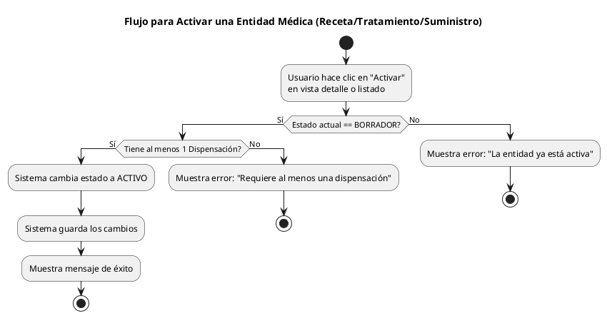
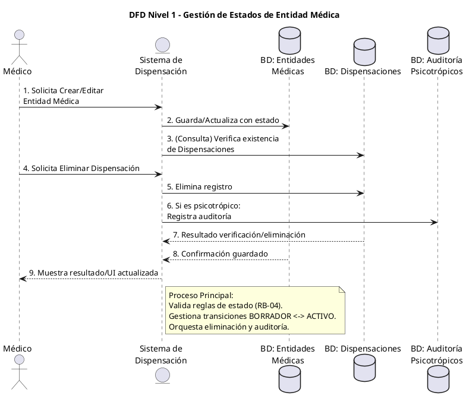

**Requerimiento Funcional: Unificación del Ciclo de Vida de Entidades Médicas y Validación de Estados**
1. Contexto y Objetivo del Cambio
El sistema actual presenta una asimetría en la validación de entidades médicas (Receta, Tratamiento Crónico, Suministro de Enfermería): permite su creación sin dispensaciones asociadas, pero bloquea su edición si no tienen al menos una. Esto genera riesgo de entidades huérfanas y una experiencia de usuario inconsistente. El objetivo es implementar un modelo de estados explícito que guíe al usuario desde la creación hasta la completitud, manteniendo la flexibilidad operativa pero garantizando la integridad de datos.
2. Alcance
Incluye:
Modificación del ciclo de vida de Receta, Tratamiento Crónico y Suministro de Enfermería.
Implementación de un campo de estado (estado) en dichas entidades.
Actualización de las reglas de validación (updating, creating) basadas en el estado.
Ajustes en la interfaz de usuario para reflejar y gestionar los nuevos estados.
Mantenimiento de la auditoría especializada para psicotrópicos.
Excluye:
Modificación de la lógica o estructura de las entidades Dispensación o AuditoríaPsicotropico.
Cambios en los flujos de eliminación o en la lógica de cascada.
Revisión del criterio de clasificación de medicamentos psicotrópicos (ASUNCIÓN: Existe un campo o lista maestra que lo define).
3. Actores y Entidades Involucradas
Actores:
Médico/Profesional de la Salud (crea y edita entidades médicas).
Farmacéutico/Enfermero (realiza dispensaciones).
Entidades del Sistema:
Entidad Médica (Receta, TratamientoCronico, SuministroEnfermeria).
Dispensación.
AuditoríaPsicotropico (entidad especializada).
4. Requerimiento Funcional (RF)
RF-01: El sistema debe asignar automáticamente el estado BORRADOR a una nueva Entidad Médica al momento de su creación.
RF-02: El sistema debe permitir guardar una Entidad Médica en estado BORRADOR sin validar la existencia de Dispensaciones asociadas.
RF-03: El sistema debe permitir la transición de una Entidad Médica del estado BORRADOR al estado ACTIVO únicamente cuando tenga al menos una Dispensación asociada.
RF-04: El sistema debe impedir la edición de los datos maestros (ej. paciente, fecha) de una Entidad Médica en estado ACTIVO si se intenta remover su última Dispensación asociada.
RF-05: El sistema debe mantener el botón "Crear Dispensación" en la vista de detalle de la Entidad Médica, el cual debe pre-llenar la relación con la entidad padre.
RF-06: El sistema debe registrar una entrada en la tabla AuditoriaPsicotropico al eliminar una Dispensación cuyo medicamento esté clasificado como psicotrópico, independientemente del estado de la Entidad Médica padre.
5. Reglas de Negocio y Validaciones (RB)
RB-01: Una Entidad Médica solo puede ser eliminada si su estado es BORRADOR. (ASUNCIÓN: Requiere confirmación).
RB-02: La eliminación de una Entidad Médica en estado BORRADOR debe eliminar en cascada todas sus Dispensaciones asociadas.
RB-03: Una Entidad Médica en estado ACTIVO solo puede ser "finalizada" o "cancelada", no eliminada. (PREGUNTA ABIERTA: ¿Se requieren estos estados? Por ahora, ACTIVO es el estado final).
RB-04: La validación de que una Entidad Médica tiene al menos una Dispensación se ejecutará en el evento updating solo si el campo estado está siendo cambiado a ACTIVO, o si ya es ACTIVO y se está removiendo la última Dispensación.
6. Caso de Uso Principal: Crear y Activar una Receta
1.  El Médico navega al módulo de Recetas y hace clic en "Crear Nueva Receta".
2.  El sistema muestra el formulario de Receta. El Médico completa los datos (paciente, diagnóstico, etc.) y hace clic en "Guardar Borrador".
3.  El sistema crea la Receta, la guarda con estado BORRADOR y redirige a su vista de detalle.
4.  En la vista de detalle, el Médico hace clic en el botón "Agregar Dispensación".
5.  El sistema abre el formulario de Dispensación con el campo "Receta ID" pre-llenado. El Médico completa los datos del medicamento y la posología y guarda.
6.  El sistema regresa a la vista de detalle de la Receta, que ahora lista la Dispensación creada.
7.  El Médico hace clic en el botón "Activar Receta".
8.  El sistema valida que exista al menos una Dispensación asociada, cambia el estado de la Receta a ACTIVO y guarda los cambios.
9.  El sistema muestra un mensaje de confirmación: "Receta activada correctamente".
7. Caminos Alternativos y Excepciones
A1 (Activación desde listado): Disparador: El Médico, desde el listado de Recetas en estado BORRADOR, selecciona "Activar" en una fila. Resultado: El sistema valida las Dispensaciones. Si hay al menos una, cambia el estado a ACTIVO. Si no, muestra error: "No se puede activar una receta sin dispensaciones".
E1 (Eliminar última dispensación de receta ACTIVA): Disparador: El Médico intenta eliminar la única Dispensación de una Receta en estado ACTIVO. Resultado: El sistema bloquea la eliminación y muestra el error: "No se puede eliminar la última dispensación de una receta activa. La receta debe volver a estado BORRADOR primero." (PREGUNTA ABIERTA: ¿Se requiere un flujo explícito para "desactivar" o volver a BORRADOR?).
E2 (Guardar cambios en receta ACTIVA): Disparador: El Médico edita un campo maestro (ej. diagnóstico) de una Receta ACTIVA y guarda. Resultado: El sistema permite la operación, ya que la validación (RB-04) solo aplica al estado y a la remoción de dispensaciones.
8. Datos y Estados
Campos/Atributos Relevantes:
Entidad Médica: id, paciente_id, diagnostico, fecha_emision, estado (BORRADOR | ACTIVO).
Dispensación: id, entidad_medica_id (FK), medicamento_id, cantidad.
AuditoríaPsicotropico: id, dispensacion_id, usuario_id, accion (ELIMINACION), fecha.
Estados Posibles:
BORRADOR: Entidad creada, puede carecer de dispensaciones. Editable y eliminable.
ACTIVO: Entidad tiene al menos una dispensación. Completamente operativa. No eliminable.
9. Criterios de Aceptación (Gherkin)
Caso 1: Creación exitosa de Receta en Borrador
Given Un usuario médico autenticado
When Completa el formulario de nueva Receta y hace clic en "Guardar Borrador"
Then La receta se guarda en la base de datos con estado BORRADOR
And El usuario es redirigido a la vista de detalle de esa receta
Caso 2: Activación fallida por falta de Dispensaciones
Given Una Receta en estado BORRADOR sin Dispensaciones asociadas
When El usuario intenta cambiar su estado a ACTIVO
Then El sistema muestra el mensaje de error "No se puede activar una receta sin dispensaciones"
And El estado de la receta permanece en BORRADOR
Caso 3: Activación exitosa con Dispensaciones
Given Una Receta en estado BORRADOR con al menos una Dispensación asociada
When El usuario cambia su estado a ACTIVO
Then El sistema guarda la receta con estado ACTIVO
And Muestra un mensaje de confirmación
Caso 4: Eliminación de Dispensación Psicotrópica
Given Una Dispensación cuyo medicamento está clasificado como psicotrópico
When Cualquier usuario autorizado la elimina
Then La dispensación se elimina de la base de datos
And Se crea un registro en la tabla AuditoriaPsicotropico con los datos de la eliminación
10. Impacto en UI/UX
Formulario de Creación: El botón de envío principal debe decir "Guardar Borrador". Opcionalmente, un botón secundario "Guardar y Agregar Dispensación" que ejecute RF-01 y luego redirija al formulario de Dispensación.
Vista de Detalle: Debe mostrar claramente el estado actual (ej. una etiqueta "BORRADOR" o "ACTIVA"). El botón "Activar Receta/Tratamiento" debe estar visible solo si el estado es BORRADOR y hay al menos una dispensación en la lista. Debe deshabilitarse con un tooltip explicativo si no hay dispensaciones.
Listados: Incluir columna "Estado" para filtrar y ordenar. La acción "Eliminar" debe estar disponible solo para registros en estado BORRADOR.
Mensajes: Implementar mensajes de confirmación para activación y errores específicos para los casos E1 y E2.
11. Riesgos/Pendientes para Decisión
1.  Transición inversa (ACTIVO -> BORRADOR): No está definido cómo o si una entidad ACTIVA puede revertirse a BORRADOR para correcciones mayores. Se requiere definir este flujo y sus reglas (¿se pierde trazabilidad?).
2.  Estados finales adicionales: El modelo actual (BORRADOR/ACTIVO) puede ser insuficiente. Se debe evaluar la necesidad de estados como SUSPENDIDO, CANCELADO o COMPLETADO para manejar el ciclo de vida completo.
3.  Consistencia transaccional: La eliminación en cascada manual sigue siendo un riesgo. Se debe evaluar la migración a transacciones de base de datos o al uso de ON DELETE CASCADE a nivel de FK, si el ORM lo permite.
---
DIAGRAMAS
Diagrama de Actividad - Flujo de Activación de Entidad Médica

DFD Nivel 1 - Proceso de Gestión de Estados
